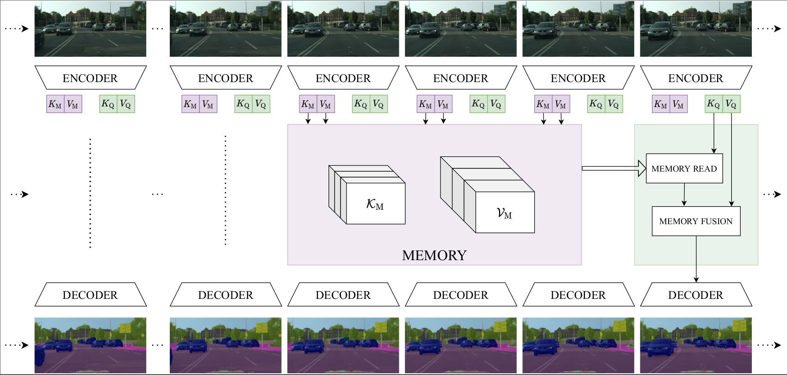

# LMANet: Local Memory Attention for Fast Video Semantic Segmentation (IROS 2021)

LMANet is fast and general video semantic segmentation pipeline written in **PyTorch** that can
convert an existing single frame model to a video pipeline.



**Authors: Matthieu Paul, [Martin Danelljan](https://martin-danelljan.github.io/), Luc Van Gool, Radu Timofte**

\[[**Paper**](https://arxiv.org/abs/2101.01715)\] | \[[**Results Video**](https://drive.google.com/drive/folders/1DaiQgc-v91ZxNvUo5Y6iRqmB4PnhSqTf)\]

# Requirements:

## Datasets

### [**Cityscapes**](https://www.cityscapes-dataset.com/)
* Please make sure sure download all necessary folders:
  * **leftImg8bit** and **leftImg8bit_sequence** to be able to work with input sequences
  * **gtFine** for the labels. 
* **Please note that before training, you first have to generate "trainIds" from "labelIds".**
  Visit [cityscapesScripts](https://github.com/mcordts/cityscapesScripts) to download the conversion script.


## Packages

The code was tested with **Python 3.8** together with **PyTorch 1.9.0** with **CUDA 11.1**.

**Additional packages required:** numpy, matplotlib, pillow, visdom, opencv, cupy, tqdm

In Anaconda you can install them with:
```
conda install numpy matplotlib torchvision Pillow tqdm
conda install -c conda-forge visdom
conda install -c conda-forge opencv
conda install -c conda-forge cupy cudatoolkit=11.1
```

# Quick Start

## Setting up data and paths

### Pretrained models

Download the following pretrained models and copy them into `trained_models/`.
Note that you have to create the folder when first clone the repository.
  - [ERFNet weights](https://github.com/Eromera/erfnet_pytorch/tree/master/trained_models)
  - [Resnet weights](https://drive.google.com/drive/folders/1Hrz1wOxOZm4nIIS7UMJeL79AQrdvpj6v)
  - [PSPNet / LMANet weights](https://drive.google.com/drive/folders/1XrGEyIKh6YmuyZZpyw8zSXuztptm9IEN)

### Datasets path

Setup the path to the root folder of Cityscapes in `datasets/cityscapes.py`.
```
CITYSCAPES_ROOT = "/path/to/cityscapes/root/containing/folder/leftImg8bit/"
CITYSCAPES_SEQ_ROOT = "/path/to/cityscapes/root/containing/folder/leftImg8bit_sequence/"
```
Most likely, those paths will be identical.


## Choosing options

* `--savedir` Only option required when running the main script. 
It provides path to the folder where debug and output files are saved.

* There is a single script for training and evaluating. 
  - `--training` Sets the pipeline in training mode
  - `--eval-mode` Set the pipeline in evaluation mode


* The important options that must most likely be set are the following:
  - `--weights`: To define the path to pretrained weights
  - `--backbone`: To define the backbone to use: (erf or psp)
  - `--corr-size`: To define the size of the correlation region
  - `--stm-queue-size`: To define the size of the memory

For further options and defaults please see the bottom of the `main.py` file. 

## Evaluation examples

Here are the commands to simply generate the results with the provided pretrained weights for 
both ERFNet and PSPNet backbones.

### Example evaluating LMANet with ERFNet:
```
python main.py --eval-mode --weights trained_models/lmanet_erf_best.pth --backbone erf \
--corr-size 21 --stm-queue-size 4 \
--savedir save/eval_lma_erf
```

### Example evaluating LMANet with PSPNet:
```
python main.py --eval-mode --weights trained_models/lmanet_psp101_best.pth --backbone psp101 \
--corr-size 21 --stm-queue-size 3 --fusion-strategy sigmoid-down1 \
--savedir save/eval_lma_psp101
```


## Training examples


### Example training LMANet with ERFNet:
Here is a simple example of training with ERFNet as backbone, setting more options and running on
two gpus. More training related parameters are set compared to the evaluation mode. 
```
export CUDA_VISIBLE_DEVICES=0,1; \
python main.py --weights trained_models/erfnet_pretrained.pth --backbone erf \
--training --gpus 2 --lr-start 2e-4 --lr-strategy plateau_08 --num-epochs 50 --batch-size 5 \
--corr-size 21 --stm-queue-size 3 --fusion-strategy sigmoid-do1 --memory-strategy all \
--savedir save/training_lma_erf
```

### Example training LMANet with PSPNet:
Here is a simple example of training with PSPNet as backbone, setting more options and running on
six gpus.
```
export CUDA_VISIBLE_DEVICES=0,1,2,3,4,5; \
python main.py --weights trained_models/pspnet101/model/train_epoch_200.pth --backbone psp101 \
--training --gpus 6 --lr-start 2e-4 --lr-strategy plateau_08 --num-epochs 50 --batch-size 1 \
--corr-size 21 --stm-queue-size 3 --fusion-strategy sigmoid-down1 \
--savedir save/training_lma_psp101
```

## Visualization

In order to visualize debug output (images, predictions and graphs), make sure that visdom is running by launching `visdom` and
adding the `--visualize` flag. This flag will work both for training and evaluation modes. 
For instance:

```
python main.py --eval-mode --weights trained_models/lmanet_erf_best.pth --backbone erf \
--corr-size 21 --stm-queue-size 4 \
--savedir save/eval_lma_erf --visualize
```
The visualization will be available in your web browser, by default at `http://localhost:8097/` 

Note that graphs and images will be in separate visdom namespaces holding the name of your experiment.
This name is defined by the last folder of your `savedir`. 
In this example, the related namespaces would contain `eval_lma_erf`


## Output files generated by default for each run:

The following files are generated in the specified `--savedir` for each run:
* `args.txt`: Text file containing the argument options used for this training.
* `<model>.py`: copy of the model file used (`lmanet.py` by default).
* `model.txt`: Text file that displays all the model layers.


### Additional training files generated
Each training will create additional files
* `automated_log.txt`: Text file which ontains in columns the following info of each epoch {Epoch, Train-loss,Test-loss,Train-IoU,Test-IoU, learningRate}.
* `best.txt`: Text file containing a line with the best IoU achieved during training and its epoch.
* `checkpoint.pth.tar`: bundle file that contains the checkpoint of the last trained epoch, contains the following elements:
  - **epoch** (epoch number as int)
  - **arch** (net definition as a string)
  - **state_dict** (saved weights dictionary loadable by pytorch)
  - **best_acc** (best achieved accuracy as float)
  - **optimizer** (saved optimizer parameters)
* `model_best.pth`: saved weights of the epoch that achieved best val accuracy.
* `model_best.pth.tar`: Same parameters as `checkpoint.pth.tar` for the best model.


# Citation


[**Local Memory Attention for Fast Video Semantic Segmentation, IROS 2021.**](https://arxiv.org/abs/2101.01715)


If you use this repository for your research, please cite our publication:
```
@inproceedings{locattseg,
  author    = {Matthieu Paul and
               Martin Danelljan and
               Luc Van Gool and
               Radu Timofte},
  title     = {Local Memory Attention for Fast Video Semantic Segmentation},
  booktitle = {{IEEE/RSJ} International Conference on Intelligent Robots and Systems, {IROS}},
  year      = {2021},
  url       = {https://arxiv.org/abs/2101.01715}
}
```

# Acknowledgement


This repository was originally built from [**ERFNet**](https://github.com/Eromera/erfnet_pytorch).
It was modified and extended to support video pipelining.

It also borrows code and models from other repositories such as [**PSPNet**](https://github.com/hszhao/semseg) 
and [**PyTracking**](https://github.com/visionml/pytracking).

